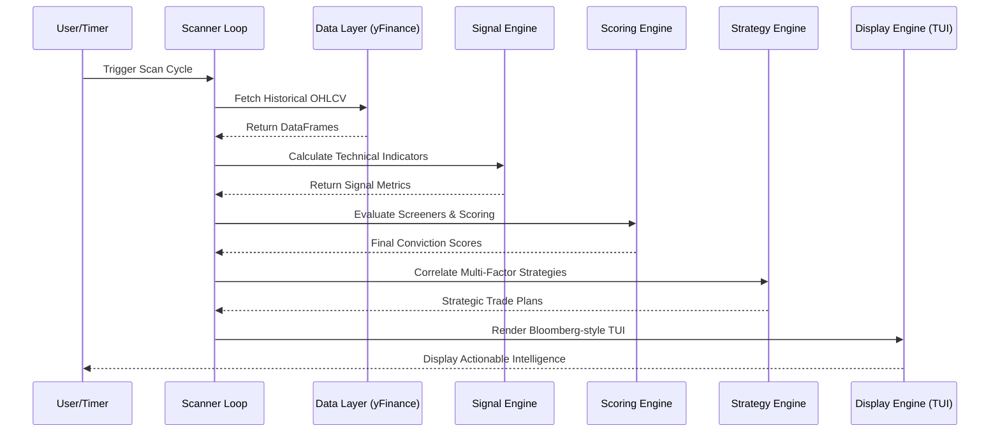

# 🦅 GS Hawk Terminal (v1.2)
[](https://opensource.org/licenses/MIT)
[](https://www.python.org/downloads/release/python-380/)
[](https://github.com/Textualize/rich)

> **"Professional Trading is about Data, Discipline, and Design."**

GS Hawk Terminal is a high-performance, Bloomberg-inspired Terminal User Interface (TUI) for Indian Equity markets (NSE/BSE). Designed for professional traders and developers, it transforms raw market data into high-conviction, actionable intelligence through a sophisticated multi-factor correlation engine.


---

## � Why GS Hawk?

In a world of cluttered web interfaces, GS Hawk provides a **Zero-Distraction, Data-First Environment**. It doesn't just scan for patterns; it correlates global macro sentiment, sector strength, and technical confluence to provide a singular **Conviction Score** for every setup.

### 🛡️ Core Capabilities

*   📊 **Confluence Core**: Aggregates RSI, MACD, Supertrend, Moving Averages, and Price Action (Hammer, NR7, Inside Bar) to filter out noise.
*   🌍 **Global Macro Pulse**: Real-time correlation with S&P 500, Nasdaq, NKY 225, and Brent Crude.
*   ⚡ **Dynamic Conviction**: Signals are automatically categorized into **High**, **Medium**, and **Low** conviction based on technical and macro alignment.
*   🔥 **Strategy-Based Grouping**: Stocks are grouped by specific trading strategies (e.g., POWER PUMP, Institutional Breakout) instead of raw indicators.
*   📈 **Ticker-Style Sparklines**: 20-day historical trend visualization directly in the terminal using Unicode braille/blocks.

---

## 🚀 Getting Started

### Prerequisites

*   Python 3.8 or higher.
*   Active internet connection for `yfinance` data fetching.

### Installation

1.  **Clone the Repository**:
    ```bash
    git clone https://github.com/gauravs19/gs-hawk-terminal.git
    cd gs-hawk-terminal
    ```

2.  **Environment Setup**:
    ```bash
    python -m venv venv
    source venv/bin/activate  # On Windows: venv\Scripts\activate
    pip install -r requirements.txt
    ```

---

## 🎮 Pro Usage

### 🔍 Advanced Scanning
Perform a Top-10 scan across the entire 1000+ stock universe:
```bash
python scanner.py --top 10
```

### 📺 Monitoring Station (Watch Mode)
Transform your terminal into a live trading desk with a 5-minute refresh cycle:
```bash
python scanner.py --watch --interval 5
```

### 🎯 Pattern Focus
Hunt for specific institutional setups (e.g., Golden Crosses):
```bash
python scanner.py --screen "Golden Cross MA25/50"
```

### 🧪 Historical Analysis
Test the terminal logic against historical data:
```bash
python scanner.py --backtest --stocks "RELIANCE.NS,SBIN.NS,TCS.NS"
```

---

## 📂 High-Level Design (HLD)

GS Hawk Terminal follows a modular, engine-driven architecture designed for low latency and high data throughput. The system is decoupled into three primary layers: **Ingestion**, **Analysis**, and **Presentation**.

### 🔄 Data Orchestration Flow

The following sequence diagram illustrates the lifecycle of a single scan cycle, from raw data ingestion to the final TUI rendering:



### 🏗️ Architectural Components

*   **Market Intelligence Unit (`core/macro.py`, `core/sectors.py`)**: Continuously monitors global proxies (S&P 500, Brent Crude) and identifies sector rotation to provide "Tailwind Multipliers" to individual stock scores.
*   **Core Analytical Pipeline (`core/signals.py`, `core/screeners.py`)**: A vectorized math engine that processes RSI, MACD, and Price Action patterns (Hammer, NR7) across 1000+ symbols.
*   **Conviction Engine (`core/scoring.py`)**: Uses a proprietary weighting algorithm to convert raw signals into a 0-10 conviction scale.
*   **Strategy & Decision Engine (`core/strategies.py`)**: The final filter that checks for *Confluence*—ensuring a trade is only suggested if multiple indicators correlate.
*   **Interface Layer (`core/display.py`)**: A high-performance rendering engine built on `Rich`, optimized for high information density and low eye strain.

---

## 📂 Project Structure

*   `core/signals.py`: Technical indicator and candlestick pattern math.
*   `core/macro.py`: Global factor analysis and sentiment scoring.
*   `core/sectors.py`: Sector-wise membership and relative strength tracking.
*   `core/display.py`: TUI rendering engine (Rich-based Bloomberg aesthetic).
*   `core/strategies.py`: Confluence and correlation logic for setup validation.
*   `config/universe.yaml`: Hierarchical stock universe (Tier 1-5).

---

## 🛠️ Configuration

Fine-tune your edge in `config/config.yaml`:
```yaml
alerts:
  desktop_notifications: true
  min_rr: 2.0
universe:
  tier1_always: true
```

---

## 🤝 Contributing

Contributions are what make the open source community such an amazing place to learn, inspire, and create.
1.  Fork the Project
2.  Create your Feature Branch (`git checkout -b feature/AmazingFeature`)
3.  Commit your Changes (`git commit -m 'Add some AmazingFeature'`)
4.  Push to the Branch (`git push origin feature/AmazingFeature`)
5.  Open a Pull Request

---

## 📜 License

Distributed under the MIT License. See `LICENSE` for more information.

## 🦅 Disclaimer
*GS Hawk Terminal is an analysis tool and does not provide financial advice. Trading involves significant risk. The developers are not responsible for any financial losses.*

---
**Designed by Gaurav Sharma | Powered by Data.**
